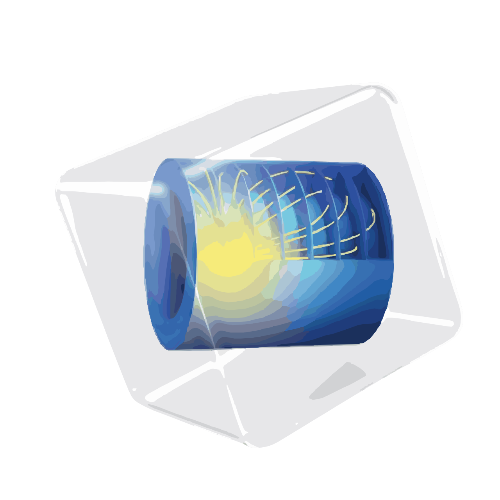

<h1 align="center">Hello , Welcome to Pouria's Github! </h1>

  

 

<h4 align="center">
I'm a major Chemical Engineering and minor Chemistry Bachelor's student at <a href="https://en.sharif.ir/"><b>Sharif University of Technology</b></a>. 
- My fields of intrest is <b>Reaction Engineering</b>, <b>Process Systems Engineering</b>, and <b>Heterogeneous Catalysis</b> in chemical engineering. 
- I’m currently learning Optimizations in Process Systems 
- In my free time, I'd like to watch motorsports, listen to western country Music, and practice in perfumery.<be>

</h4>

 
 

<h2 align="center">Github Stats </h2>
 
<a align="center" href="https://github.com/Pouria-MK">

 

<h2 align="center">Preferred Sorfwares </h2>

Languages and Simulators that I know and would like to work with 

 
<table align="center">
  <tr>
    <td align="center" width="96">
      
       Python
    </td>
    <td align="center" width="96">
      
       MATLAB
    </td>
    <td align="center" width="96">
      
       COMSOL
    </td>
    <td align="center" width="96">
      
       GAMS
    </td>
    <td align="center" width="96">
      
        ASPENTECH
    </td> 
  </tr>
</table>
 

<h2 align="center">Reach out to me from the platforms below </h2>

	
	
	

	

<i align="center">Credit: [Pouria-MK](https://github.com/Pouria-MK) </i> 
<i align="center">Last Edited on: 10/3/2024 </i> 

<!--
**Pouria-MK/Pouria-MK** is a ✨ _special_ ✨ repository because its `README.md` (this file) appears on your GitHub profile.

Here are some ideas to get you started:

- 🔭 I’m currently working on ...
- 🌱 I’m currently learning ...
- 👯 I’m looking to collaborate on ...
- 🤔 I’m looking for help with ...
- 💬 Ask me about ...
- 📫 How to reach me: ...
- 😄 Pronouns: ...
- ⚡ Fun fact: ...
-->
